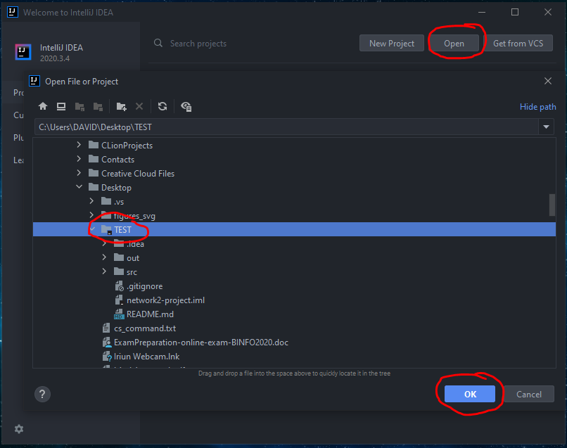
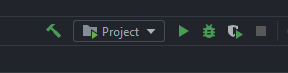
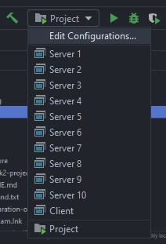
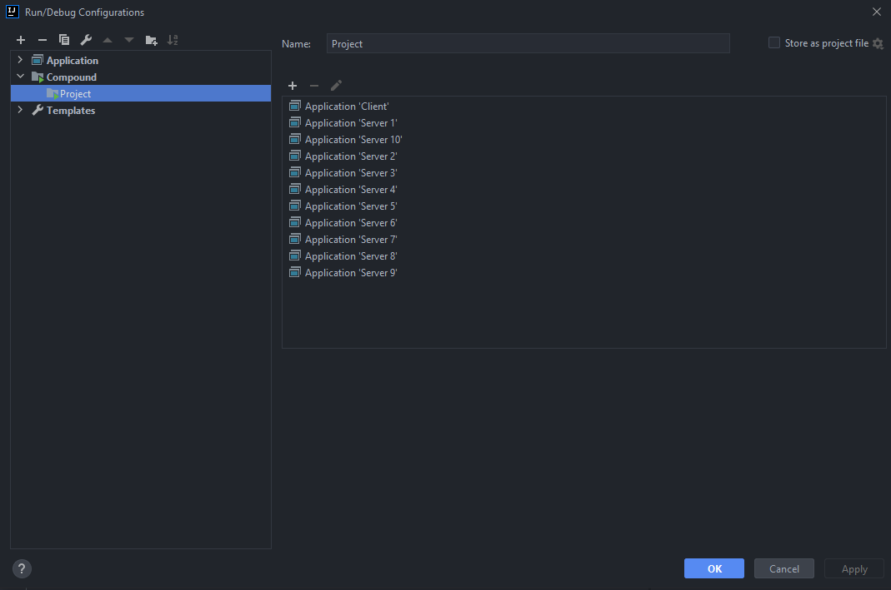

# Networks 2 - Project

Here we will explain how to run our program in Intellij and Eclipse.

## Intellij
Firstly open the project. 
 
Open -> Select project -> ok 

After you should se that a compound has been already set. 
 

If you want to check what that compound contains you can click on: 
Project (run part) -> Edit Configurations... 
 
 

Why did we use a compound? 
Since we have just 1 code for the servers, we need to execute it multiple times. So that our implementation works right you need to execute 10 times the Server.class and 1 time the Client.class. 

## Eclipse