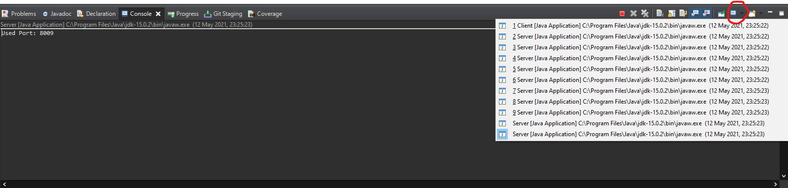

# Networks 2 - Project

Here we will explain how to run our program in Intellij and Eclipse.

## Intellij
Firstly open the project. 
 
Open -> Select project -> ok 

After you should se that a compound has been already set. 
 

If you want to check what that compound contains you can click on: 
Project (run part) -> Edit Configurations... 
 
 

Why did we use a compound? 
Since we have just 1 code for the servers, we need to execute it multiple times. So that our implementation works right you need to execute 10 times the Server.class and 1 time the Client.class. 

## Eclipse
Firstly open the project by selecting "Open Projects from File System". 
Select the directory of the project and click "Finish". 
 

After that right click on the project and click on "Run as" and then click on "Run configurations". 
 

Then click on "Java Application" and click on the icon "Add new launch configuration". 
After that click on search and click on Client and change the Name of the configuration to "Client". 
After that click on the icon "Add new launch configuration" again, after that click on search but this time select the Server and change the Name of the configuration to "Server". 
 

Now click on "Launch Group" and click on the icon "Add new launch configuration", change the name of the configuration to "Key-Value Storage Project". 
After that click on the "Add..." button and add one client. 
After that click on the "Add..." again and add a server --> repeat this until you got 10 servers. 
After that click apply and click "Run" now our Program should start and you should be able to test it. 
 

To change between servers and the client click on this icon shown on the image and select the desired server/client. 
 
